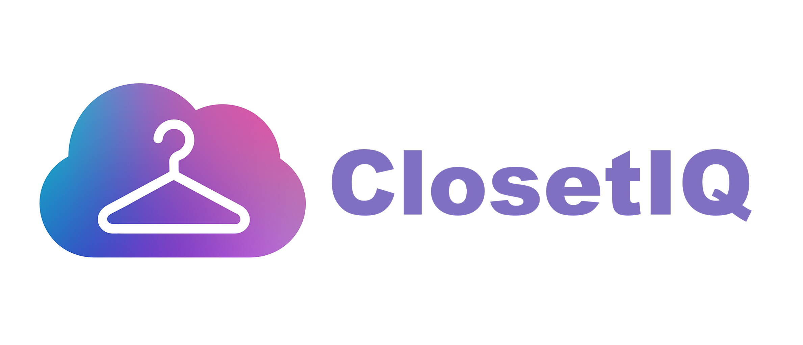

# ClosetIQ



Group project for CEN3031 Introduction to Software Engineering

**Node.js must be installed on system as a prerequisite**

To install dependencies for and run frontend:

```
cd client
npm install
npm run dev
```

To install dependencies for and run backend:

```
cd server
npm install
npm run dev [or] node server.js
```

You must run <code>npm install</code> after cloning the repo to get the <code>node_modules/</code> dependencies directory in both <code>client/</code> and <code>server/</code> in order for frontend and backend to run properly.

To setup environment variables, create a <code>.env</code> file in <code>server/</code> and add this information:

```
ATLAS_URI="your_mongodb_uri"

JWT_SECRET="secret"
NODE_ENV="development"

SMTP_USER="your_brevo_username"
SMTP_PASS="your_brevo_password"
SENDER_EMAIL="your_brevo_sender_email"

CLOUDINARY_CLOUD_NAME="your_cloudinary_cloud_name"
CLOUDINARY_API_KEY="your_cloudinary_api_key"
CLOUDINARY_API_SECRET="your_cloudinary_api_secret"
```

**This is assuming you have already set up an account with MongoDB Atlas, Brevo SMTP, and Cloudinary**